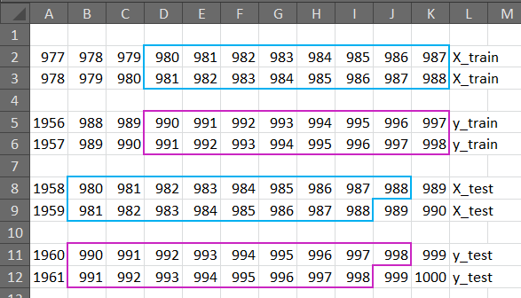
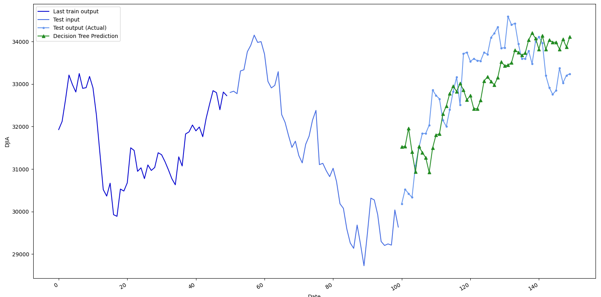
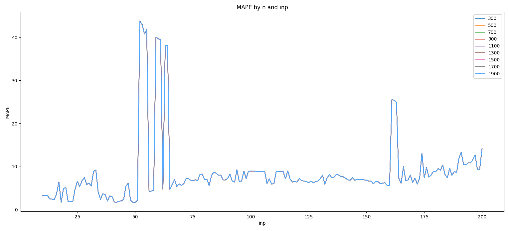
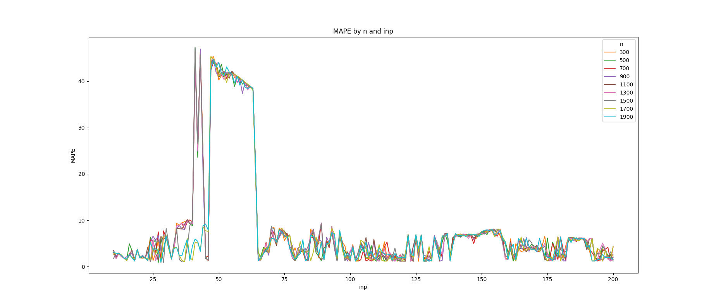

# Pitfalls-of-time series forecasting II
 
In [this](https://github.com/mankle26/Pitfalls-of-time-series-forecasting) 
post I described why I believe
[this tutorial](https://towardsdatascience.com/the-complete-guide-to-time-series-forecasting-using-sklearn-pandas-and-numpy-7694c90e45c1)
to time series forecasting is flawed. 
Although, there are for sure better ways to handle such tasks, 
here I want to offer a way to fix the tutorial while keeping
its general strategy. 

## Recalling the Problem

As I described previously the main issue is that the model 
gets to know a relevant share of the data it is later asked to predict,
leading to a lagged prediction of the actual test outcome.

We can illustrate this overlap between train and test set with
a simple data set containing 1000 ascending
entries from 1 to 1000.
When we apply the same code as before, giving us an Excel sheet 
with train and test data in one file we can clearly see that
the numbers 980 to 988 are part of both the X_train and the 
X_test data set and numbers 990 to 998 are part of the y_train
as well as the y_test data set. 



### Towards a solution

In the comments, someone raised concerns about the 
"window-input-output"-function, and more precisely 
that the minus symbol before "output_length" should
be dropped. However, testing this solution only results in a 
different and slightly shorter overlap of train and test
data but does not fix the issue.

I believe the error occurs in the splitting of the 
data set in train and test data.
He states that two rows are "reserved" for testing, but 
in fact, this means it only excludes 
**two observations from the original data**. 
This is why y_train in the above example ends at 998, 
while y_test goes until 1000. 

Instead, it would be necessary to drop rows accounting to
**two times the window frame** in order to completely 
separate train and test data in this model. 

In fact, if we drop two times the window frame and
use only one row for testing
(he also uses only one row for his graphics, 
although he predicts two)
, there is no overlap between train and test data whatsoever.

So, here is the new code with an example for 
a window of 50. I adjusted the plot to make the seperate
data points visible. The graph shows the last 50 steps 
that are used for training (y_train), the 50 steps that
are used for testing (X_test) and the next 50 steps in
their actual format and the prediction of those.

```python
import numpy as np
import pandas as pd
import matplotlib.pyplot as plt
from sklearn.tree import DecisionTreeRegressor

data = pd.read_csv("djia.csv")
data.index = pd.to_datetime(data['date'], format='%Y-%m-%d')
del data['date']
data = data[36673:]


def mape(y_true, y_pred):
    return round(np.mean(np.abs((y_true - y_pred) / y_true)) * 100, 2)


def window_input_output(input_length: int, output_length: int, data: pd.DataFrame) -> pd.DataFrame:
    df = data.copy()

    i = 1
    while i < input_length:
        df[f'x_{i}'] = df['close'].shift(-i)
        i = i + 1

    j = 0
    while j < output_length:
        df[f'y_{j}'] = df['close'].shift(-output_length - j)
        j = j + 1

    df = df.dropna(axis=0)

    return df


# set up model and run it
seq_df = window_input_output(50, 50, data)
X_cols = [col for col in seq_df.columns if col.startswith('x')]
X_cols.insert(0, 'close')
y_cols = [col for col in seq_df.columns if col.startswith('y')]

X_train = seq_df[X_cols][:-(window*2)].values
y_train = seq_df[y_cols][:-(window*2)].values
X_test = seq_df[X_cols][-1:].values
y_test = seq_df[y_cols][-1:].values

dt_seq = DecisionTreeRegressor(random_state=42)
dt_seq.fit(X_train, y_train)
dt_seq_preds = dt_seq.predict(X_test)

# plot the prediction
fig, ax = plt.subplots(figsize=(16, 11))
ax.plot(np.arange(0, window, 1), y_train[-1], color='mediumblue', label='Last train output')
ax.plot(np.arange(window, window*2, 1), X_test[0], color='royalblue', label='Test input')
ax.plot(np.arange(window*2, window*3, 1), y_test[0], marker='.', color='cornflowerblue', label='Test output (Actual)')
ax.plot(np.arange(window*2, window*3, 1), dt_seq_preds[0], marker='^', color='forestgreen', label='Decision Tree Prediction')
ax.set_xlabel('Date')
ax.set_ylabel('DJIA')
plt.legend(loc=2)

fig.autofmt_xdate()
plt.tight_layout()
plt.show()
```



We can see that the three data sets
of the graph have no overlap and 
the prediction is not a lagged version of the actual data (but 
looks quite good in this case actually...).

## Open questions?

Did this solve all the issues with the original code and output?

Well, not quite. If we plot again the MAPES by n (size of the
original data set) and the prediction window, we get this graph:



For comparison, this is how it looked before:



In general, the MAPES make much more sense now. They do not
drop to nearly zero in some cases (indicating the lagged prediciton)
and they gradually grow with a longer prediction window (it
should be harder to predict longer windows accurately). They also 
do not depend at all on the size of the original data frame (all
lines for different n overlap entirely). This indicates that more
data does not help in predicting the Dow Jones, a result as 
devastating as trivial: Future gains are not a function of the past.

However, we still note these sharp rises around prediction windows 
between 51 and 60, and to a lesser extent at 160. I still have no
explanation why this is happening. If you do, please let me know.

____
I would like to thank [Vegard Flovik](
https://no.linkedin.com/in/vegard-flovik) for
discussing these issues with me, leading to this post.

